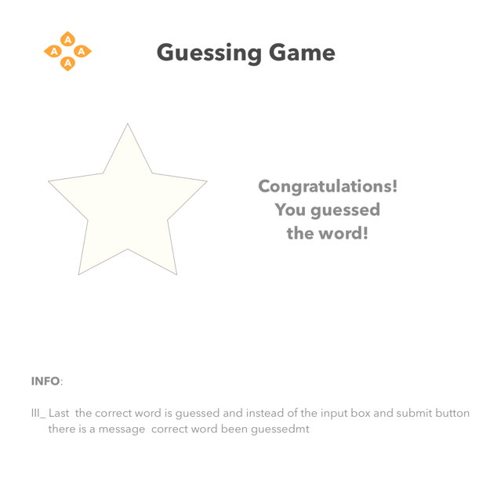

# Guessing-game &nbsp; :name_badge: 
 

:baggage_claim: Tech stack: &nbsp; tdd - react -redux - html - css - sketch

 

## About

A short game where a user tries to guess a random generated five letter word
by the computer.  
At load, it shows the game instructions and asks user to guess word.  
Once user submits a word (at least 3 characters long), a table appears
below the text input box section showing the number of matching letters against
the computer's word or a message indicating that you have guessed it correctly.  
Fetching word GET/req <repo>`[game-server-repo] http://localhost:[process.env.PORT || 3000]/word`

## Tests &nbsp; :traffic_light:

Tests found under `__tests__` folder

## Instructions &nbsp; :pill:

1. To clone/download see `green button` above.
2. Install dependencies
3. Terminal:  
   • Open in browser: `npm start`  
   • Run tests: open a new tab `ctrl tab` and type `npm run test`  
   • See `Package.json scripts` for other useful commands

 

## Wireframes &nbsp; :triangular_ruler:

### screenshots

 
<kbd>mckup1</kbd>
 

  

<kbd>mckup2</kbd>
 

  

<kbd>mckup3</kbd>
 

  

## Todo

- Get remaining tests passing
- Wire up current app state

The end &nbsp; :100:
